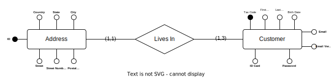

# Business Bank Management
The following document is a draft of functional requirements
of the application. Each parts contains the specifications
about how data are organized in the database, what are the
available operations on them, and the business rules that must
be implements.

## Customers
The main actor of the system is the __Customer__. Each customer
represents a real person, and their personal information. We
would like to store addresses information, and personal 
information.

For each customer, there at most 3 __Addresses__, but at least one,
each __Address__ contains the following information: Country,
State, Name of the city, Name of the Street, Street number
and Postal Code. 

Each __Customer__ is identified by a Tax Code, has an unique email address,
that must be verified before starting to use their account
in the system, and of course name, surname and birth date. Each
customer must be at least eighteen years old, and
needs a password to use their account.

Indeed, it is necessary to upload a copy of their __ID Card__
that must be formatted in pdf. 

## E-R Diagram

Representing these data in form of a E-R diagram, we are able
to produce the following result:

after that, we can translate the ER diagram in SQL tables:

